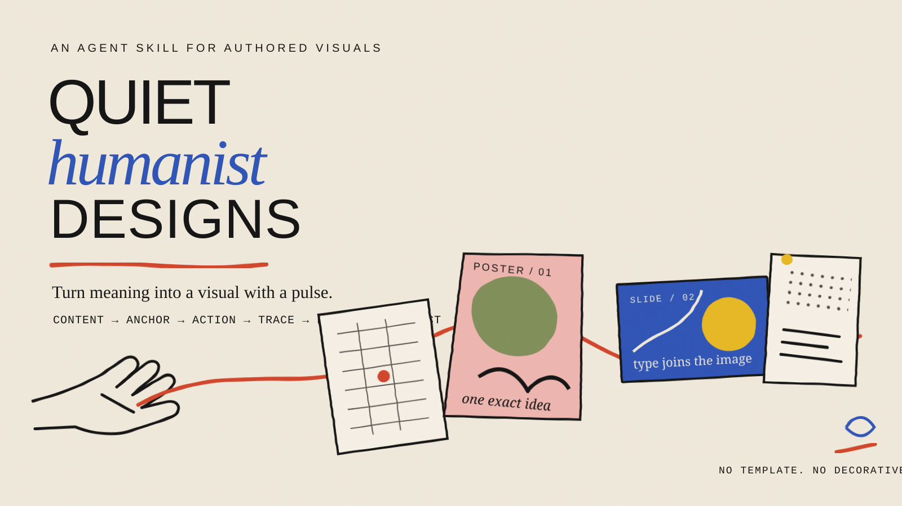

<p align="center">
  
</p>

# Create Quiet Humanist Designs

A design skill for turning a real idea into a finished visual with a point of view.

它不是给普通海报加一点纸张纹理，而是先理解内容，再找到具体的符号、动作和痕迹，最后把图像与准确文字组装成完整作品。

## What it makes

- posters and social graphics
- presentation covers and section slides
- email headers and editorial cards
- web heroes and frontend visual moments
- invitations, covers and small campaigns

The output can be quiet, playful, cinematic or strange. It should still be understandable, content-specific and recognizably made by a person.

## What makes it different

Most visual prompts begin with style. This skill begins with meaning.

It asks what enters, what changes, what comes out and what proves the change. It then builds a visual sentence from a recognizable subject, a specific action and a visible consequence. Handmade line, print texture, color and type come afterwards.

The finished artifact must include exact typography and a deliberate reading order. A generated illustration by itself is not treated as a finished poster.

## Install

With the Skills CLI:

```bash
npx skills add pepperliu722-sudo/create-quiet-humanist-designs --skill create-quiet-humanist-designs
```

Or copy [`skills/create-quiet-humanist-designs`](skills/create-quiet-humanist-designs) into your agent's skills directory.

## Try it

```text
Use $create-quiet-humanist-designs to turn this product feature into a 4:5
social poster. First explain the feature in plain language, then create three
visually different directions. Keep all final copy exact and editable.
```

```text
调用 $create-quiet-humanist-designs，把这篇文章做成一张有具体符号和人物动作的
编辑海报。不要先套风格，也不要只做一张有氛围的插画。最后把标题、说明和署名完整排进去。
```

```text
Use $create-quiet-humanist-designs to translate this campaign into an email
header, a presentation title slide and a web hero. Keep the idea coherent,
but redesign the composition for each medium instead of cropping one poster.
```

## The working method

```text
content model
    ↓
visual anchors
    ↓
anchor + action + trace
    ↓
three genuinely different directions
    ↓
image and exact typography assembled together
    ↓
full-size and thumbnail QA
```

The detailed rules live in [`SKILL.md`](skills/create-quiet-humanist-designs/SKILL.md). Supporting references are loaded only when the task needs them, so the core skill stays focused.

## Repository structure

```text
skills/create-quiet-humanist-designs/
├── SKILL.md
├── agents/openai.yaml
└── references/
    ├── semantic-to-visual.md
    ├── creative-direction.md
    ├── artistic-editorial-language.md
    ├── functional-poster-grammar.md
    └── ...
```

Created and maintained by [pepperliu722-sudo](https://github.com/pepperliu722-sudo).
